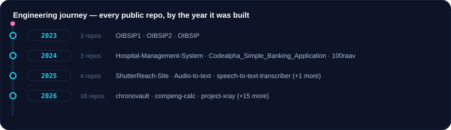

 

 

## Who I am

Software engineer whose work is measured by what ships and stands up — never by demos or dashboards. Computer Science undergraduate at **Noida International University** (Greater Noida), building continuously since 2023:

- **Web Development Intern — Oasis Infobyte** (2023): responsive, production-minded front-end work.
- **Java Application Development Intern — CodeAlpha** (2024): banking application, real data handling, one of the most-watched repos in my open-source set.
- **Peer reviewer — Clarivate/Web of Science journals** (2026): 6 completed journal reviews, verified and public on my [ORCID record](https://orcid.org/0009-0002-8578-2330).

I read code across the stack, review other people's work against the same standards I hold my own, and I do not ship what I cannot prove.

## What I am for

I build the quiet tools that let people do the important work — a code-time machine, a repository X-ray, a calculator that respects precision, an interview room that works like a real one.

## How I build

Every project here follows one discipline: **ship → test → prove → document.** Verified workflows, automatic rollback, byte-accurate tests, and READMEs that tell you what the system actually does. 26 public projects, every one of them real, every one of them reproducible.

## Featured projects

 

[View all 26 public repositories](https://github.com/100raav?tab=repositories)

## Real activity — this last 12 months

 

 

 

## The stack I actually build with

Everything on this profile — the contribution calendar, the language split, the journey — is measured from the live GitHub API. No fabricated numbers, no sample data.

## Contact

