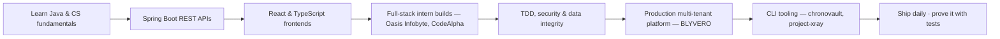

  

  

  
  
  
  

---

## 👨‍💻 Who I am

- **Computer Science & Engineering student**, Greater Noida — Delhi NCR.
- I build **full product stacks, end-to-end**: UI → API → authentication → authorization → business logic → database → events → audit. Not screenshots — executable, testable systems.
- **Java-first.** Spring Boot 3, Hibernate, JWT/RBAC, Flyway migrations on the backend; React + TypeScript + Vite on the frontend.
- **Security and data-integrity obsessed**: deny-by-default authorization, tenant isolation that is never trusted to the UI, verified checkpoints, exactly-once event delivery.
- I ship **CLI tooling** too — real command-line products with web dashboards, not just web CRUD.
- Open to **backend, full-stack, and platform-engineering** roles.

> “I don’t call something done until the full execution chain works and the evidence exists to prove it.”

---

## 🏛️ The flagship — **BLYVERO** 

A **production-grade, multi-tenant digital-organization platform** — one shared platform, many tenant organizations, each with its own configurable modules, roles, website, and ERP. This is where my engineering principles get exercised at scale.

| Area | What's real inside |
| --- | --- |
| **Platform** | Spring Boot 3 modular monolith on **Java 25**, PostgreSQL + Flyway, React + TypeScript SPA, server-rendered public websites per tenant |
| **Tenant isolation** | Tenant resolved from host/preview-token — never from client input; every tenant row is scoped in the DB; cross-tenant leaks return 404/403 |
| **Events (exactly-once)** | Transactional outbox + RabbitMQ; correlated **publisher confirms** so no message is ever silently lost; consumer inbox ledger absorbs duplicate deliveries |
| **Security** | Deny-by-default RBAC, per-principal rate limiting, login-lockout recorder, upload sanitization + deny lists, JSON 401/403, audit-logged |
| **Proven by tests** | **89/89** security-negative matrix, **87/87** golden-journey E2E (full lifecycle: register → org → site publish → ERP versions → roles → payments), **168+** automated checks across the suite |
| **Infra** | Redis cache, MinIO/S3 object storage, 2-instance fleet on one shared queue |

The repository is **private** — I'm happy to share it on request with any team (demo walkthrough or read access). *No seeded data: every number in it is real work or a passing test.*

---

## 🚀 Featured projects

<table>
<tr>
  <td align="center"><b>⚡ chronovault</b> <i>Java · CLI · Gradle</i></td>
  <td align="center"><b>🔍 project-xray</b> <i>Java/Spring intelligence</i></td>
  <td align="center"><b>🧮 compeng-calc</b> <i>JS · HTML · CSS</i></td>
</tr>
<tr>
  <td width="33%">A <b>code time machine</b>: <code>checkpoint</code> only snapshots when your real build + tests pass; <code>diagnose</code> proves what broke it; <code>restore</code> is crash-safe with <b>automatic rollback</b> if verification fails. SHA-256 content-addressed dedup, 9 project adapters, web dashboard, VS Code + IntelliJ companions. <b>48/48 tests.</b> <a href="https://github.com/100raav/chronovault">github.com/100raav/chronovault →</a></td>
  <td width="33%">Real-repository <b>architecture intelligence</b> for Java/Spring: scans the actual code, resolves symbols, and emits an evidence-backed architecture graph + dependency galaxy + code-health radar — built as a VS Code tooling MVP. <a href="https://github.com/100raav/project-xray">github.com/100raav/project-xray →</a></td>
  <td width="33%">Professional <b>computer-engineering calculator</b> — Basic, Programmer, Scientific, Network & Converter modes in a premium glassmorphism UI. Zero dependencies, responsive on every device. <a href="https://github.com/100raav/compeng-calc">github.com/100raav/compeng-calc →</a></td>
</tr>
</table>

<table>
<tr>
  <td align="center"><b>🤖 talent-IQ</b> <i>React · Node</i></td>
  <td align="center"><b>📚 BookStore Management</b> <i>Spring Boot · JWT · MySQL</i></td>
  <td align="center"><b>🧰 react-dev-tool-suite</b> <i>React · Vite · Vercel</i></td>
</tr>
<tr>
  <td width="33%">AI interview & coding platform: VS Code–powered editor, Clerk authentication, 1-on-1 video interview rooms, <b>isolated code execution</b> with pass/fail auto-feedback on test cases. <a href="https://github.com/100raav/talent-IQ">github.com/100raav/talent-IQ →</a></td>
  <td width="33%">Secure REST API: JWT auth, role-based access (ADMIN/CUSTOMER), book & order management, pagination + search, MySQL, Swagger documentation. <a href="https://github.com/100raav/BookStoreManagement">github.com/100raav/BookStoreManagement →</a></td>
  <td width="33%">Mini-IDE in React: code editor + JS runner with user input + regex tester in one clean interface. <a href="https://github.com/100raav/react-dev-tool-suite">repo</a> · <a href="https://react-dev-tool-suite.vercel.app/">live demo</a></td>
</tr>
</table>

**More on the shelf:** `erp-system` (Spring Boot ERP backend) · `notes-management-app` (React + Vite, Vercel) · `Medical-Ledger` · `Blockchain-SImulation-Project` (Java) · `Audio-to-text` + `speech-to-text-transcriber` · Oasis Infobyte + CodeAlpha internship builds (`OIBSIP` tasks, banking app) · and more.

---

## 🧰 Tech I work with

  

---

## 📈 Live on GitHub

  
  

  

---

## 🧭 Engineering journey

---

## 🎯 What guides my work

- **Never fake a feature.** Done = the full chain works and tests prove it.
- **Security is the system, not the UI.** Authorization is enforced server-side; identity is verified, not assumed.
- **Production data integrity.** Empty states beat fabricated dashboards, every time.
- **Automation everywhere.** Outbox publishers, publisher confirms, idempotent consumers, automated rollback — boring reliability beats clever demos.

---

## 📬 Let's talk

You can reach me here — always happy to walk through the architecture, the test suites, or just talk shop:

  
  
  
  

  Built from real repositories, real tests, and real deployment evidence — no placeholders.

