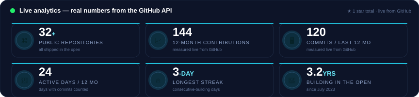

 
 

---

 
 

 

PROFILE

## Full-Stack Software Engineer — Java · Spring Boot · React · Node.js

SUMMARY

 

- **Full-stack engineer** — designs and ships production-grade software end to end: CLI developer tools, REST &amp; ERP backends, and responsive web applications, rooted in strong foundations in data structures, algorithms, and the software development lifecycle.
- **28+ open-source repositories** — every project built, tested, documented, and released in the open since 2023.
- **8 peer reviews** — recorded on <a href="https://www.webofscience.com/wos/author/record/NOF-2861-2025">Web of Science</a>.
- **B.Tech · Computer Science &amp; Engineering** — Noida International University, Greater Noida.
- **Full-stack internships** — The Skybrisk (Full Stack Java Developer), Labmentix (Full Stack Developer), and Oasis Infobyte (Web Development).

 
 

---

 
 

<h3 align="center">Education</h3>

 

 
 

---

 
 

<h3 align="center">Experience</h3>

 

 
 

---

 
 

<h3 align="center">Selected projects — what they are, and what they are used for</h3>

 

 

 

<a href="https://github.com/100raav?tab=repositories">View all 28 public repositories</a>

 
 

---

 
 

<h3 align="center">Live GitHub activity</h3>

 

LIVE ANALYTICS
 

 
 
 

ENGINEERING JOURNEY — EVERY PUBLIC REPO BY YEAR
 

 
 
 

MOST-USED LANGUAGES — REAL BYTE COUNT ACROSS ALL PUBLIC REPOS
 

 
 

---

 
 

<h3 align="center">Core technologies — the stack I build with</h3>

 

<table>
  <tr>
    <td width="150" align="center"> Java</td>
    <td width="150" align="center"> Spring Boot</td>
    <td width="150" align="center"> JavaScript</td>
    <td width="150" align="center"> React</td>
  </tr>
  <tr>
    <td align="center"> TypeScript</td>
    <td align="center"> Node.js</td>
    <td align="center"> Next.js</td>
    <td align="center"> Vite</td>
  </tr>
  <tr>
    <td align="center"> MySQL</td>
    <td align="center"> HTML5</td>
    <td align="center"> CSS3</td>
    <td align="center"> Maven</td>
  </tr>
  <tr>
    <td align="center"> Gradle</td>
    <td align="center"> Git</td>
    <td align="center"> GitHub</td>
    <td align="center"> Vercel</td>
  </tr>
</table>

 
 

---

 
 

<h3 align="center">A techie joke — fresh on every visit</h3>

 

 
 

---

 
 

<h3 align="center">Contact</h3>

 

